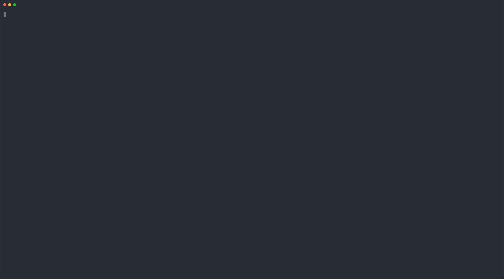

# Teo </img>
A programming language for kids designed to be fast and easy to learn.

A submission for NSC 2023 by Chitsanupong Rongpan (ชิษณุพงษ์ รองปาน).

</img>

## Getting up and running
- Download lastest [CI Artifacts](https://github.com/teolang/teo/actions/workflows/c-cpp.yml) on Github CI
- or, [compile](#compiling-with-cmake) yourself with `cmake` (Recommended)

## Compiling with CMake
Dependencies:
- Git
- CMake
- Make
- GNU Compiler Collection (You can use CLANG+LLVM by set the environment variable `CC=clang` and `CXX=clang++`)
- GTK3 (Runtime dependencies) [Windows users don't need to install this if they download from the CI Artifacts]
```bash
git clone https://github.com/teolang/teo --depth=1 --recurse-submodules
cd teo
make release -C cparse
cmake . -B build
cd build && make
```
